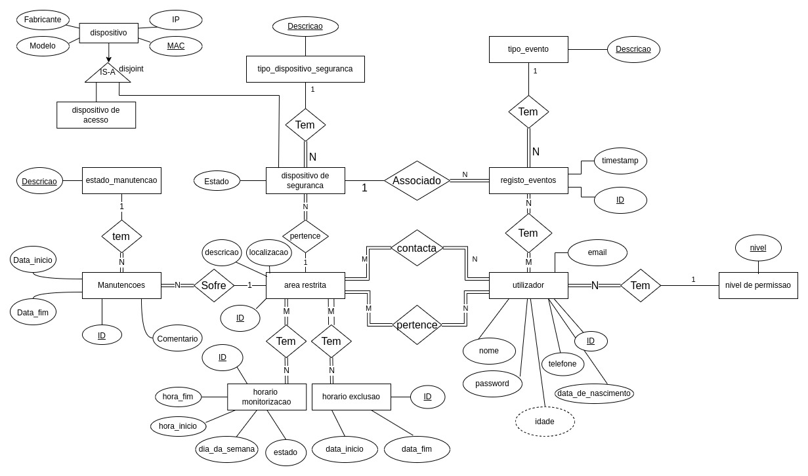
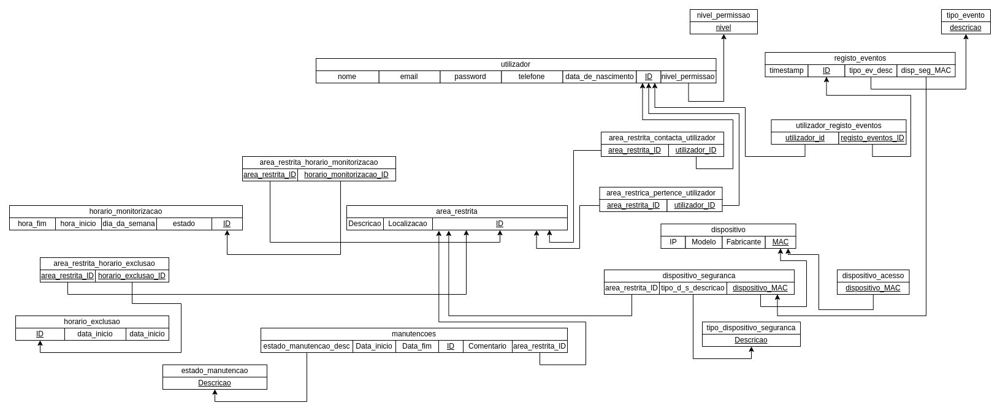

# WasteNot-Warning

Este projeto consiste em um sistema de alarme hipotético no qual possamos usar equipamentos, como câmaras, sensores, computadores que já tenhamos, ou de outras marcas, para integrarem o sistema.

# Autoria

Grupo p1g6:

* Gonçalo Silva, 103244
* Tiago Silvestre, 103554

# Contribuições
Tiago Silvestre: 50%
Gonçalo Silva: 50%

# Tecnologias Usadas

As seguintes tecnologias foram usadas neste projeto:

* Frontend: [VUEjs](https://vuejs.org/)
* Backend: Python [Flask](https://flask.palletsprojects.com/en/2.3.x/)
* Base de Dados: [Microsoft Sql Server](https://www.microsoft.com/en-us/sql-server)
* Ambiente: [Docker](https://www.docker.com/)

# Sistema Operativo utilizado

Esta plataforma foi desenvolvida e testada para executar em Ubuntu 22.04, configurações extras podem ter de ser efetuadas para suporte de outros Sistemas Operativos.

# Configuração

Antes de continuar com a execução, vai ser preciso ter as ferramentas Docker e Docker compose na sua máquina. Caso não as tenha, for favor siga as instruções em [get docker](https://docs.docker.com/get-docker/) e [install compose](https://docs.docker.com/compose/install/).

Após ter as ferramentas instaladas, execute uma das seguintes opções.

### Desenvolvimento

Com esta configuração o sistema usará a base de dados local do Docker.

```bash
docker compose build
```

### Produção

Com esta configuração o sistema usará a base de dados de produção, localizada no IEETA.

```bash
docker compose -f docker-compose-prod.yml build
```

Para construir o ambiente docker, com todas as dependências e serviços.

# Execução

Para executar a plataforma, execute uma das seguintes opções

### Desenvolvimento

Com esta configuração o sistema usará a base de dados local do Docker.

```bash
docker compose up
```

### Produção

Com esta configuração o sistema usará a base de dados de produção, localizada no IEETA.

```bash
DB_RESET_FLAG=true docker compose -f docker-compose-prod.yml up
```

**Nota**: Para reiniciar a base de dados, pode tirar partido de um script para esse efeito, por executar o comando com a seguinte Flag:

```bash
DB_RESET_FLAG=true <opcao_de_execucao (docker compose ...)>
```

### Primeira execução

Na primeira execução, execute primeiro só o container só com o sql server:

```bash
docker compose up sql-server
```

Executando em seguida o comando para reiniciar a base de dados:

```bash
DB_RESET_FLAG=true docker compose up
```

# Requisitos

1. Um utilizador é caracterizado pelo seu nome, nível de permissão, data de nascimento, um identificador único, password, email e numero de telefone.
2. Existem 3 níveis de permissão, utilizador comum, administrador, utilizador externo
3. Apenas utilizadores autenticados podem ter acesso ao sistema
4. Um administrador tem acesso a tudo.
5. Apenas certos dispositívos podem aceder ao sistema para efetuar alterações ou visualizar informação. Esses sistemas são adicionados pelo administrador e caraterizados pelo fabricante, modelo, numero MAC e endereço IP
6. Dispositivos de segurança são caracterizados por um tipo, área restrita a que pertencem, numero MAC e endereço IP, fabricante, modelo, estado (Ligado/Desligado).
7. Os tipos possiveis de dispositivos de segurança são portões, portas, cameras de vigilancia, sensores de movimento, alarmes
8. Eventos em dispositivos de segurança devem ser registados, guardando-se a data,hora e tipo de evento que ocorreu, qual utilizador utilizou o dispositivo.
9. Os tipos possíveis de eventos são abrir, fechar,deteção de movimento, ativação de alarme
10. Cada área restrita é caracterizada por uma localização, descrição, utilizadores que a podem aceder.
11. Uma área restrita tem uma lista de utilizadores que devem ser contactados em caso de emergencia, caso hajam vários cada um tem um horário em que podem ser contactados (tipo ter vários seguranças por turnos), código de utilização de dispositivos
12. Uma área restrita pode ser configurada para ter dias da semana, com hora de inicio e de fim, recorrentes em que os dispositivos estão ativos em modo de monitorização (Não acionam o alarme). Também deve ser possível colocar essa regra ativa ou inativa.
13. Deve ser possível configurar dias de exclusão para as alturas de funcionamento (data/hora inicio e fim).
14. Dispositivos podem sofrer manutenções, a uma manutenção está associada uma área restrita, sendo caracterizada pela data de inicio, data de fim, estado, comentários (opcional) e uma lista de  utilizadores externos (mandatório).

# Diagramas

Com base nos requisitos e nas necessidades do sistema, modelámos os seguintes diagramas:

## Diagrama Entidade-Relacionamento

Diagrama DER 

# Esquema Relacional

Esquema Relacional 

# Funcionalidades

De forma a tornar o nosso sistema mais modular, decidimos colocar os vários elements SQL em ficheiros separados. Para os executar todos juntos e popular a base de dados, fazemos uso da funcionalidade descrita na secção de *Execução*.

## Modelação tabela

No ficheiro `src/database/WasteNotWarning_db.sql` está presente o ficheiro SQL para criar e modelar a Base de Dados, com as tabelas definidas.

## Operações de CRUD

O ficheiro `src/database/populate.sql` contém um conjunto de Inserts para popular a base de dados com dados, sendo que num deles é usado um While para gerar um número de registos maior e mais aleatório. No entanto, no ficheiro `src/back/queries.py`, está contido no objeto *query_mapping*, o conjunto de queries que o backend faz com a base de dados.

## Other queries

No ficheiro `src/database/other_queries.sql` estão outras queries que foram usadas durante a modelação da Base de Dados.

## User Defined Functions

As UDFs estão localizadas no ficheiro `src/database/udfs.sql` e cada uma efetua a seguinte tarefa:

* **GetLastUserEvents**: Aceita como argumento o ID do utilizador e o máximo número de eventos que devem ser pesquisados. Retorna os últimos eventos do utilizador ordenados pela coluna Timestamp.
* **GetAreasRestritasByUserId**: Recebe como parâmetro o ID de um utilizador e retorna as áreas restritas em que ele pertence.
* **GetLastRepairsOfARestrictedArea**: Recebe como argumento o Id de uma área restrita e o número máximo de linhas da pesquisa, retorna as próximas manutenções da área restrita ordenadas pela data de início da manutenção
* **GetDeviceListOfARestrictedArea**: Aceita como argumento o Id de uma Área Restrita e retorna o número de Dispositivos de Segurança associados a essa Área Restrita
* **GetHorariosMonitorizacaoByRestrictedArea**: Aceita como argumento o Id de uma Área Restrita e retorna os Horários de Monitorização associados a essa Área Restrita
* **PaginatedEvents**: Aceita como um argumento um offset, fetch e um type, para interagir com a paginação e ir buscar os eventos com base no tipo (acionaram alarme, excluidos e durante periodos de manutenção). O fetch representa o número de registos e o offset, é o index do registo inicial para retornar.
* **GetEventIdsInRepairingScheduleFunc**: Retorna os Ids dos eventos que ocorreram em periodo de manutenção (Foi criados por causa da paginação e filtração)
* **GetEventIdsInExclusionTimeFunc**: Retorna os Ids dos eventos que ocorreram em periodo de exclusão ou alarme desativado (Foi criados por causa da paginação e filtração)
* **GetEventIdsInActiveScheduleFunc**: Retorna os Ids dos eventos que ocorreram em periodo de alarme ativo (Foi criados por causa da paginação e filtração)

## Stored Procedures

As Stored Procedures  estão localizadas no ficheiro `src/database/stored_procedures.sql` e cada uma efetua a seguinte tarefa:

* **GetRowCountOfEventsInExclusionTime**: Seleciona o número de eventos que aconteceram fora do horário de monitorização da Área Restrita ou que aconteceram dentro do Horário de Exclusão e que não aconteceram enquanto o sistema estava em manutenção
* **GetRowCountOfEventsInRepairingSchedule**: Seleciona o número de eventos que aconteceram durante período de manutenção
* **GetRowCountOfEventsInActiveSchedule**: Seleciona o número de eventos que aconteceram numa altura em que o sistema foi acionado
  * Para o sistema ser acionado, um evento tem de ocorrer dentro do Horário de Monitorização da Área Restrita associada ao Dispositivo de Segurança, fora de alguma horário de exclusão associado e numa data em que a Área Restrita não tenha sofrido uma Manutenção
* **getAlarmActivated**: Selecionar os eventos que podem acionar o alarme, de uma forma customizada, que ocorreram nos últimos 120 segundos. Quando este é chamado pelo website, o website fica com o alarme acionado até o utilizador pressionar para Desarmar o sistema.
* **GetEventIdsInRepairingSchedule**: Seleciona os Ids dos eventos que ocorreram em periodo de manutenção
* **GetEventIdsInExclusionTime**: Seleciona os Ids dos eventos que ocorreram em periodo de exclusão ou alarme desativado
* **GetEventIdsInActiveSchedule**: Seleciona os Ids dos eventos que ocorreram em periodo de alarme ativo

## Views

No ficheiro `src/database/stored_procedures.sql`, estão localizadas as views que fazem as seguintes seleções:

* **events_count_by_category**: Selecionar o número de eventos, agrupados por tipo de evento
* **next_repairs**: Selecionar as próximas manutenções que irão acontecer (em qualquer área restrita)
* **list_ordered_events**: Selecionar, os eventos com o seu tipo, dispositivo associado e Área Restrita

## Triggers

No ficheiro `src/database/triggers.sql` estão localizados todos os triggers utilizados na base de dados.

* **trg_CreateDispositivoSeguranca**: Trigger do tipo *INSTEAD OF* que quando é criado um dispositivo de segurança e não existir um dispositivo com o mac, é criado primeiro um dispositivo base e somente depois é feito o insert na tabela dos dispositivos de segurança.
* **trg_CheckDateValidity**: Trigger do tipo *AFTER* que quando é criada ou atualizada uma manutenção com data de fim menor que a data de início, é lançado um erro e é feito rollback ao insert ou update.

## Indexes

* **idx_registo_eventos_timestamp**: Index na coluna timestamp que aumenta a eficiência das queries que pesquisam em função da coluna timestamp seja através de pesquisas em intervalos de tempo ou quando é feita uma ordenação em função desta coluna.
* **idx_dispositivo_mac**: Existem algumas queries que fazem pesquisas a dispositivos pelo endereço MAC, este index aumenta a eficiência deste tipo de queries.
* **idx_utilizador_telefone**: Quando é feito o login é feita uma pesquisa à base de dados pelo utilizador através da coluna Telefone, como podem existir muitos utilizadores de forma a aumentar a eficiência desta query colocou-se um index na coluna "Telefone".

## Transações
* **AddUserEvent**: Adiciona um evento associado a um utilizador, o registo do evento é criado bem como a associação ao utilizador. Caso uma inserção falhe é feito um rollback à transação e é lançada uma excepção.

## Paginação e Filtração

Usando a UDF *PaginatedEvents* definida anteriormente, foi possível implementar paginação e filtração, por chamar esta udf com um offset, um número de registos para obter e o tipo de registo de evento (acionou alarme, excluido e em periodo de manutenção). Esta UDF tira partido deste suporte já embutido no SQL Server com o seguinte código:

```SQL
OFFSET @offset ROWS
FETCH NEXT @fetch ROWS ONLY
```

Este offset é simplesmente calculado pelo frontend usando o seguinte código:

```TypeScript
const offset = (pageNumber - 1) * numberOfEventsPerPage;
```

Fazendo com que seja fácil ao selecionar uma página para ver os registos, estes serem retornados com base no `pageNumber` ou número de página fornecido

## Login

A funcionalidade de login está present no backend, no ficheiro  `src/back/App.py` e usa as queries estabelecidas no ficheiro  `src/back/queries.sql`. Na base de dados é guardada uma *Hash* da palavra passe e um *Salt*. Quando o utilizador introduz a sua palavra passe, esta e o *Salt* são juntas e formam uma *Hash* que será comparada com a que está registada na base de dados. Para efetuar-mos isto, fazemos uso do algoritmo [PBKDF2](https://en.wikipedia.org/wiki/PBKDF2). Desta maneira, mesmo que um atacante obtenha acesso à base de dados, não conseguirá deduzir a palavra-passe dos utilizadores.

## Interação entre o backend e a interface

O backend (flask) disponibiliza vários endpoints, sempre que o frontend pede informação ao backend estes endpoints são utilizados. Cada endpoint é capaz de aceder à base de dados, obtendo assim informações de forma segura. Os endpoints estão no ficheiro `src/back/App.py`. Para comunicação entre a API e o frontend, estes endpoints da API são usados em conjunção com os do frontend, localizados na pasta `src/front/src/services/backend-api`.

## Segurança por tokens

Para aumentar a segurança entre o backend e fronted, foi usado um token, que é gerado e enviado pelo backend quando um utilizador inicia sessão. O módulo usado foi o *JWTManager* pertencente à package *flask_jwt_extended*. Isto também significa que a plataforma tem implementado a funcionalidade de caso o utilizador não interaja com a mesma durante algum tempo, a sua sessão irá ser terminada e terá de efetuar login novamente.

## Website

No desenvolvimento do website, foi dado um maior foco aos usos principais, que são:

* Dashboard sólido, com bastantes funcionalidades e métricas
* Funcionalidade de acionar e desativar alarme
* Interação com os utilizadores (Ver, eliminar e adicionar)
* Inicio de Sessão
* Visualização das Áreas Restritas e associação de dispositivos a Áreas Restritas

### Template

Como referido no [README](./src/front/README.md) na pasta do frontend, nós optámos por usar um template de VueJs com bastantes components já criados e construímos os nós desenvolvimentos "por cima".

### Acionar o alarme

Para acionar o alarme, dirija-se para o Dashboard e garanta que o botão de Alarme se encontra em `Armado` e o que o Estado do Sistema seja `O alarme está Armado e a Funcionar`. Após isso, execute o script `src/database/triggerAlarm.sql`.

Dentro de aproximadamente 10 segundos, o Alarme deverá aparecer a vermelho e com o texto de `Acionado`.
## Vídeo de demonstração da plataforma

Video está localizado no seguinte caminho `/documentation/WasteNotWarningVideo.mp4`

[video de demonstracao](./documentation/WasteNotWarningVideo.mp4)
